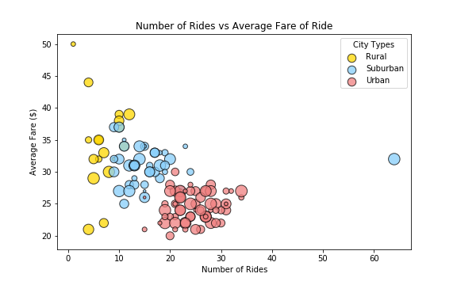

# Data-Visualization-With-Pandas
Using matplotlib functions to analyze and visualize data sets
 
## Pyber (Analysis of Rideshare Data)

The ride sharing bonanza continues! Seeing the success of notable players like Uber and Lyft, you've decided to join a fledgling ride sharing company of your own. In your latest capacity, you'll be acting as Chief Data Strategist for the company. In this role, you'll be expected to offer data-backed guidance on new opportunities for market differentiation.

You've since been given access to the company's complete recordset of rides. This contains information about every active driver and historic ride, including details like city, driver count, individual fares, and city type.

Your objective is to build a [Bubble Plot](https://en.wikipedia.org/wiki/Bubble_chart) that showcases the relationship between four key variables:

* Average Fare ($) Per City
* Total Number of Rides Per City
* Total Number of Drivers Per City
* City Type (Urban, Suburban, Rural)

In addition, you will be expected to produce the following three pie charts:

* % of Total Fares by City Type
* % of Total Rides by City Type
* % of Total Drivers by City Type

 

## Results 
### Three Takeaways
 * As one would expect, rural areas have the highest average fare due to having to travel farther than more densely populated areas (Urban and    even Suburban).
*  Urban areas account for 78 percent of all Pyber drivers and 62% of all Pyber rides.
*  Urban areas have the shortest distance but the most volume of rides, therefore they account for almost 50% of total Pyber Revenue. look    to exploit ride surges in urban areas for improved profit.

## Method
The following pandas commands were utilized in this project:
    * reading in large CSV files and turning them to DataFrames
    * merging, grouping, and indexing data to find the desired results
    * Agg function to do quantity analysis (count, mean, sum) of different variables
    * Using the iloc/loc method to extract desired parts of DataFrames to query data for visualizations.
    * matplotlib for graphing: bubble plots, pie charts, seaborn styles, etc.

# Visualizations

The desired bubble plot is shown below. The size of the bubbles indicates the number of available drivers in a city. As mentioned earlier, rural cities tend to have higher fares.
